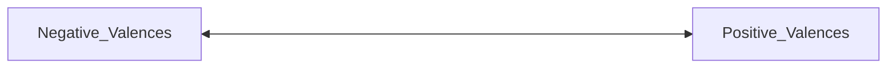

## 1.1 Aspects of the mentality

What are the differences between minded creatures and creatures that lack minds?
    Are there creatures that lack minds? 
        Perhaps bacteria? 
    Good, then what is the difference between bacterium and persons?

---

## Mental Capacities

- Perception: Capacity to perceive a range of objects and events in their environment
	- I don’t know if bacterium have perceptions. There are environmental conditions, and then they have reactions.
- Agency: Are agents → efficient actions i.e., control of behavior (they certainly cannot be agents)
	- reaching for a cup of coffee
	- looking for a friend
	- deciding which pant leg to put on first
- Thought: Some creatures (like us) can think
<!-- Column 1 -->
	- weigh competing sources of evidence
	- consider the consequences of various plans of action
	- adopt the perspectives of other creatures

<!-- Column 2 -->
	- manipulate the world
	- exploit capacity for action (take control over our environment)

---

### Other kinds of faculties

<!-- Column 1 -->
- Memory
	- perception of the past

<!-- Column 2 -->
- Emotion
	- perceiving
	- thinking
	- acting

<!-- Column 3 -->
- Imagination
	- see the future
	- counter-factuals

---

## Mental Phenomena

### Mental Events

Dated particular happenings
<!-- Column 1 -->
	- Sensory
		- headaches
		- itches
		- pains
		- sensations
		- feelings

<!-- Column 2 -->
	- Non-sensory, i.e., cognitive
		- recognizing a punchline
		- or an insult

---

### Mental Processes

### Mental States / Standing States

Mental phenomena that do not unfold over time.
	- Beliefs
		For instance, the belief that the earth is round is a persistent mental state. One does not lose the belief just because they are asleep or frightened. (But what about when in a haunted house? You might believe that the zombie is just an actor, but are still frightened even though you are generally not afraid of actors.
	- Desires and intentions

---

## Mental Properties

Difference between mental properties and mental states: 
    nature, 
        different objects can have the same property (two people can be the same height)
        But mental states are particulars, no two objects can have the same mental state. (Datable and locatable occurrences)

---

## 1.2 Privacy of the Mental

Looking to find a property that distinguishes mental phenomena from non-mental phenomena. A property or collection of properties that is both necessary and sufficient for mentality. 
    This talks about the access one has to a certain kind of state. 
        I might know that you have a headache for instance if you tell me that you have a headache. But I do not have “direct” access to your headache.
        Therefore, there seems to be a contrast between the kind of access that one has to one’s current mental states, and the kind of access that we have to the mental states of other people.

---

### Can privacy distinguish between mental and non-mental?

<!-- Column 1 -->
Some minded persons do not have private access to their mental states
<!-- Column 1 -->
	1. Young children
	2. Brain damage victims
	3. non-human animals that lack access to private mental states
		1. Anton’s syndrome

<!-- Column 2 -->

<!-- Column 2 -->
Some phenomena need expert diagnoses
	1. What about phenomena such as 
		1. anger, depression, grief
	2. In cases of self-deception

<!-- Column 3 -->
Mental states that lack first-person access
	1. Perceptual illusions
		1. that explain the illusions
	2. Certain kinds of representational states
		2. like the arts (imagine seeing a play and being emersed in the play)
	3. Sub-personal representational states that explain behavior

---

## 1.3 Intentionality

We don’t just want to be able to distinguish between mental and non-mental, but we also want to be able to identify features that *might* illuminate the nature of mentality. Does intentionality do this?

### Franz Brentano (1838-1917)

Philosophy of psychology, introduced the concept of intentionality
> [all mental phenomena have in common is] that they are only perceived in inner consciousness, while in the case of physical phenomena only external perception is possible (PES 128)

also worked in philosophy of mind, metaphysics, ontology, ethics, logic, history of philosophy and philosophical theology

Introduced concept of scientific rigor into philosophy

But best known for having introduced intentionality to contemporary philosophy
> Every mental phenomenon is characterized by what the Scholastics of the  Middle Ages called the intentional (or mental)‡ inexistence of an object, and what we might call, though not wholly unambiguously, reference to a content, direction toward an object9 (which is not to be understood here as meaning a  thing),10 or immanent objectivity. (PES, 111)

---

A word that is applied to purposeful and goal directed actions.
    Take mental states
        Desire
            The object of my desire to to visit Madagascar is “Madagascar”
        Belief
            The object of my belief that Valentina Tereshkova is was the first woman in space is “Valentina Tereshkova”.
        Perception
            The object of a perception that the sun is yellow is “the yellow sun”

---

Most are ordinary and publicly accessible
    Desire
        The object of my desire to to visit Madagascar is “some island off the coast of the African continent”
    Belief
        The object of my belief that Valentina Tereshkova is was the first woman in space is “Some particular astronaut”.
    Perception
        The object of a perception that the sun is yellow is “some extra planetary body”

---

Some are not necessarily ordinary or publicly accessible
    Intentional states caused by going without sleep for long periods of time
    Fictional objects: we can think about non-existent objects while being fully aware of their non-existence (12)

---

<!-- Column 1 -->
Intentional States with the same kinds of Objects

<!-- Column 2 -->
Intentional States (hallucinations) without ordinary physical objects 
    spider when afraid of spiders

---

## 1.4 Consciousness

<!-- Column 1 -->
People/Organisms
    people who are awake/dreaming
    mammals are conscious
    conscious mental states
    creatures as conscious

<!-- Column 2 -->

people who are unconscious

plants?

subconscious mental states

creature’s mental state

---

Kinds
<!-- Column 1 -->
    sensory consciousness
    qualitative
    reflexive

<!-- Column 2 -->
    awareness
    experience
    qualia

## 1.5 Folk Psychology

## 1.6 Conclusion

# Week 2: Suffering of the Physical

> There is a special kind of pain in watching someone whom you love in agony and being helpless to help him. (Stump 2010, xvii)

> Nonetheless, romantic love, no doubt, often has a distinct physiological, bodily, and chemical profile. When you fall in love, your body chemicals go haywire. (Brogaard  2015, 12)

What is love?
    Drive, feeling, or an emotion.

<!-- Linked database (not supported by Notion API) -->

<!-- Linked database (not supported by Notion API) -->
